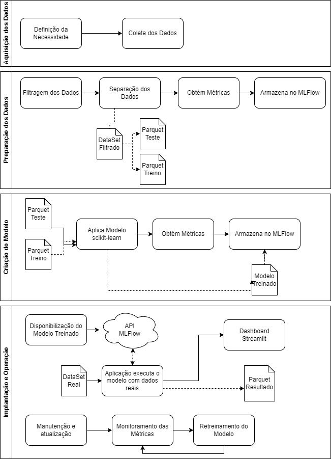

## <b>Pergunta 2</b>:
Para começar o desenvolvimento, desenhe um diagrama que demonstra todas as etapas necessárias em um projeto de inteligência artificial, desde a aquisição de dados, passando pela criação dos modelos, indo até a operação do modelo.

<b>Resposta:</b> 

## <b>Pergunta 3</b>:
Descreva a importância de implementar pipelines de desenvolvimento e produção numa solução de aprendizado de máquinas.

<b>Resposta:</b> 

A importância e o sucesso da implementação de pipelines no desenvolvimento é uma garantia de repetibilidade, eficiência, governança, monitoramento e colaboração. As equipes de desenvolvimento podem trabalhar de forma automatizada e mais colaborativa, permitindo versionamento de modelos, análise de resultados, reaplicação de modelos e controle do processo de liberação, desde o desenvolvimento até a produção, auxiliando na identificação de falhas de forma rápida e eficiente. Como resultado, as empresas podem melhorar a eficiência geral dos processos, aprimorar a produtividade da equipe e acelerar os prazos de entrega de soluções.

## <b>Pergunta 4</b>:
Como as ferramentas Streamlit, MLFlow, PyCaret e Scikit-Learn auxiliam na construção dos pipelines descritos anteriormente? A resposta deve abranger os seguintes aspectos: Rastreamento de experimentos; Funções de treinamento; Monitoramento da saúde do modelo; Atualização de modelo; Provisionamento (Deployment).

<b>Resposta:</b> 

Em suma, o MLFlow garante organização e acompanhamento, o PyCaret e o Scikit-Learn oferecem expertise no treinamento, e o Streamlit é a interface para a interação com o usuário.

a. Rastreamento de experimentos: MLFlow possibilita a rastreabilidade de experimentos, o que permite aos desenvolvedores validarem as métricas, parâmetros e artefatos de cada experimento. Isto facilita a comparação de diferentes modelos e configurações, bem como o monitoramento das alterações de desempenho no ciclo de vida.

b. Funções de treinamento: PyCaret e Scikit-Learn possuem várias funções de treinamento para machine learning, sendo elas: classificação, regressão e clusterização. Em especial o PyCaret que automatiza o processo de treinamento, pré-processamento, seleção dos hiperparâmetros de uma maneira muito simples e prática.

c. Monitoramento da saúde do modelo: Neste item se destaca o MLFlow que permite monitorar a saúde do modelo e registrar métricas relacionadas ao desempenho. Este mecanismo facilita a identificação de problemas de desempenho caso seja identificada uma queda de performance, garantindo que o modelo ainda seja relevante, possuindo um papel de gestor do ciclo de vida do projeto.

d. Atualização de modelo: O MLFlow permite o gerenciamento de versões dos modelos e a aplicação de atualizações, permitindo aos desenvolvedores implantar novas versões e comparar o desempenho das mesmas.

e. Provisionamento (Deployment): Neste cenário, o Streamlit é o elo entre o usuário e o modelo, permite a criação de aplicativos web interativos para modelos já treinados de machine learning. Garante que os desenvolvedores criem interfaces de usuário amigáveis para seus modelos e as implantem facilmente em servidores ou plataformas de nuvem. Além disso, o MLFlow também oferece funcionalidades para implantar modelos em produção em diferentes plataformas como AWS, Azure e Kubernetes, facilitando o provisionamento e o monitoramento do modelo durante sua vida.

## <b>Pergunta 5</b>:
Com base no diagrama realizado na questão 2, aponte os artefatos que serão criados ao longo de um projeto. Para cada artefato, indique qual seu objetivo.

<b>Resposta:</b>

1. Aquisição dos Dados

    Dado a necessidade, é gerado o arquivo original que possui todos os arremessos do Kobe Bryant, nessa etapa sendo representado pela já separação entregue: 

        a. “Data/Raw/dataset_kobe_dev.parquet” = Representa os dados que devem ser treinados por modelos.
        b. “Data/Raw/dataset_kobe_prd.parquet” = Representa os dados que devem ser processados no modelo final que tenha o melhor resultado ou o de classificação como solicitado no trabalho.

2. Preparação dos Dados
    Responsável por esse processo “Code/PreparacaoDados.py”
        
        Geração do “Data/Processed/data_filtered.parquet” = Dataset filtrado e pré-processado com as regras exigidas.
        
        Geração do “Data/Processed/base_train.parquet” = Dataset  de treino para ser utilizado pelo modelo.
        
        Geração do “Data/Processed/base_test.parquet” = Dataset  de teste para ser utilizado pelo modelo.
        
        Armazena no MLFlow na run “PreparacaoDados” as métricas como “base_treino_tamanho” e “base_teste_tamanho”, juntamento com o parâmetro que informa o tamanho utilizado para base de teste denominado: “teste_percentual” .

3. Criação do Modelo
    Responsável por esse processo “Code/Treinamento.py”
        
        Para cada modelo testado:
            
            Armazena no MLFlow na run “Treinamento” as métricas do modelo em questão, sendo elas “log_loss” e “f1_score”, a tag que informa o algoritmo utilizado “model” e por último o modelo treinado.

            Geração do “Data/Modeling/rl_model_treined.pkl” e “Data/Modeling/dt_model_treined.pkl” que representam os arquivos pickle dos modelos de Regressão Logística e Árvore de Decisão.

4. Implantação e Operação
    Responsável por esse processo “Code/Aplicacao.py”
        
        Disponibiliza o modelo da árvore de decisão através da API do MLFLow, sendo acessível pelo endpoint ”/invocations”.

        Após a execução dos dados reais no modelo, é armazenado o artefato do resultado do processamento na run “PipelineAplicacao”.

    Responsável por esse processo “Code/Dashboard.py”
        
        Disponibiliza um Dashboard no Streamlit para monitoramento da saúde e resultados do modelo.

## <b>Pergunta 6 - Item B</b>:
Ainda sobre essa seleção, qual a dimensão resultante do dataset?

<b>Resposta:</b>

O dataset de DEV original possui 24271 registros e após o processo de filtragem dos dados, possui 20285 registros.

## <b>Pergunta 6 - Item C</b>:
Separe os dados em treino (80%) e teste (20 %) usando uma escolha aleatória e estratificada. Armazene os datasets resultantes em "/Data/processed/base_{train|test}.parquet . Explique como a escolha de treino e teste afetam o resultado do modelo final. Quais estratégias ajudam a minimizar os efeitos de viés de dados.

<b>Resposta:</b>

A forma como o treinamento e teste são separados podem influenciar significativamente na eficácia do modelo. Uma divisão inadequada pode levar a problemas de overtraining ou overfitting, especialmente em conjuntos de dados desbalanceados. Para minimizar esses efeitos, é recomendado utilizar estratégias como validação cruzada, estratificação na divisão de treino e teste, realizar um pré-processamento dos dados, normalização, análise de correlações, engenharia de features, entre outros.

## <b>Pergunta 7 - Item C</b>:
Com os dados separados para treinamento, treine um modelo de classificação do sklearn usando a biblioteca pyCaret. A escolha do algoritmo de classificação é livre. Justifique sua escolha.

<b>Resposta:</b>

O algoritmo escolhido foi Árvore de Decisão por 2 motivos, o primeiro foi porque utilizei esse método nesta mesma base na disciplina anterior e por conta disso queria comparar os resultados e o segundo motivo é porque a árvore permite uma fácil interpretação das variáveis mais importantes e possui um baixo custo de processamento.

## <b>Pergunta 8 - Item A</b>:
O modelo é aderente a essa nova base? O que mudou entre uma base e outra? Justifique.

<b>Resposta:</b>

O modelo não é aderente a nova base, o modelo foi treinado usando uma base de dados que possui somente arremessos de 2 pontos, na base final, todos os dados da base são de arremessos de 3 pontos, portanto, o modelo erra nas predições dos arremessos já que a distância da cesta para o arremesso muda consideravelmente,  uma forma de visualizar a mudança repentina da métrica é comparar o run de “Treinamento” com log loss de 16.107234203240136 contra o “PipelineAplicacao” com log loss de 18.71446157121567, ficando claro que com os dados de 3 pontos ficou pior no modelo.

## <b>Pergunta 8 - Item B</b>:
Descreva como podemos monitorar a saúde do modelo no cenário com e sem a disponibilidade da variável resposta para o modelo em operação.

<b>Resposta:</b>

Monitorando a saúde do modelo, podemos utilizar as métricas que mais se enquadram aos dados que estamos utilizando, quando estas variáveis estão disponíveis, contudo, é fundamental estar atento às previsões incorretas, à distribuição dos dados e garantir que os novos dados estejam em conformidade com a distribuição anterior utilizados no treinamento, sendo uma boa prática manter sempre o modelo atualizado.

## <b>Pergunta 8 - Item C</b>:
Descreva as estratégias reativa e preditiva de retreinamento para o modelo em operação.

<b>Resposta:</b>

Estratégia reativa ocorre quando é identificado uma queda de performance, por exemplo: Aumento na taxa de erro, mudança dos dados, etc, neste cenário é necessário o retreino do modelo. Já a estratégia preditiva ocorre antes da identificação de queda de performance, desta forma o modelo é retreinado com novos dados sempre que possível, aumentando assim a sua taxa de acertos.

